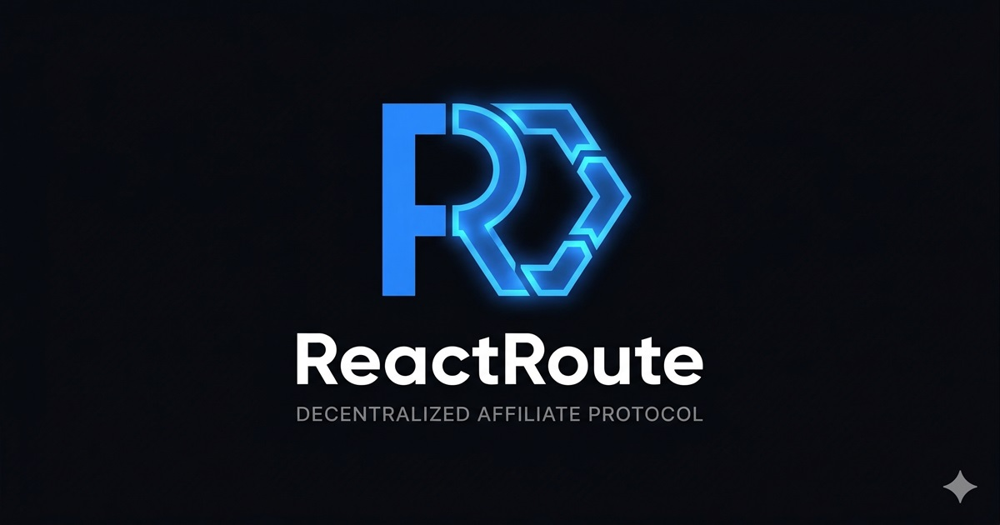

<p align="center">
  
</p>

<h1 align="center">ReactRoute</h1>

<p align="center">
  <strong>The Decentralized, Zero-Touch Affiliate Routing Protocol built for the Somnia Network.</strong>
</p>

<p align="center">
  <a href="https://reactrouteprotocol.web.app/"><strong>Live Demo</strong></a> · 
  <a href="https://youtu.be/eaiOrJbsmfg"><strong>Video Pitch</strong></a>
</p>

---

## 🎬 See it in Action

[](https://www.youtube.com/watch?v=eaiOrJbsmfg)
*Click the image above to watch the full 3-minute end-to-end demonstration.*

---

## ⚡ The Problem vs. The ReactRoute Solution

**The Problem:** Traditional Web3 referral systems are isolated and rigid. If a protocol wants to launch an affiliate program, developers have to heavily modify and redeploy their core smart contracts to hardcode referral logic and splits.

**The Solution:** ReactRoute is a **Universal B2B2C Protocol**. By leveraging the Somnia Network's native On-Chain Reactivity Engine (`ISomniaEventHandler`), ReactRoute allows *any* existing dApp to instantly retrofit a referral program onto their live contracts. 

Simply input your contract address, define your event signature, and fund your treasury vault. The moment a conversion event fires on the Somnia network, our Sentinel intercepts it, dynamically slices the unindexed byte data to calculate the split, and routes the capital to the affiliate atomically—in the exact same block. **Zero modifications to your core codebase required.**

---

## ✨ Key Features

- **Universal Compatibility:** Works dynamically with any existing smart contract emitting standard events.
- **Atomic Execution:** Referrer extraction and capital routing happen natively on-chain without Web2 backends, cron jobs, or claiming delays.
- **Dynamic Bytecode Parsing:** The ReactRoute Sentinel utilizes low-level Assembly (`calldataload`) and dynamic Topic Indices to extract purchase amounts from unindexed event payloads.
- **Real-Time Analytics:** Fully decentralized tracking for Total Payouts, Total Conversions, and Affiliate Leaderboards stored natively in the Manager vault.
- **EVM-Agnostic Frontend:** Built with Flutter Web, featuring automatic network switching, multi-wallet injection support, and strict transaction polling.

---

## 📸 Platform Gallery

### 1. Marketer Dashboard: Universal Campaign Deployment
*Plug in any contract, define the event signature, and set the routing logic.*


### 2. Marketer Dashboard: Vault Management & Analytics
*Monitor total conversions, top up the treasury vault, and view the Affiliate Leaderboard.*


### 3. Affiliate Gateway: Campaign Discovery
*Affiliates can browse active campaigns globally and generate immutable referral links.*


### 4. Checkout Sandbox: Live Network Testing
*A simulated Web3 storefront to test the end-to-end purchasing and routing flow.*


### 5. Affiliate Dashboard: Earnings Tracking
*Affiliates watch their balances increase instantly. No manual claim buttons.*


### 6. Atomic On-Chain Execution
*Explorer view proving the atomic payout execution triggered by the Reactivity Sentinel.*
![Explorer Transaction]](https://github.com/user-attachments/assets/181f283f-4d4d-4388-89bd-6e1b08c922d1)

---

## 🏗️ Architecture & How It Works

ReactRoute utilizes a dual-contract architecture designed for strict security and seamless scaling:

1. **`CampaignManager.sol`**: The treasury vault and configuration hub. Stores marketer budgets, parses active reward limits (flat fee vs. percentage), and maintains on-chain affiliate analytics.
2. **`ReactRouteSentinel.sol`**: The execution engine. Implements Somnia's `ISomniaEventHandler`. Intercepts events directly from Somnia validators (`0x0100`), extracts the referrer, and commands the `CampaignManager` to execute the payout.
3. **`ExampleMarket.sol`**: Included in this repo as a sandbox contract mimicking a third-party storefront, utilized solely for E2E testing.

*Note for Mainnet:* The Sentinel utilizes a `reactivityValidator` state variable to ensure only official Somnia Network nodes can trigger payouts, preventing bad actors from faking conversions.

---

## 💻 Tech Stack

- **Smart Contracts:** Solidity, Hardhat, Ethers.js
- **Network:** Somnia Testnet (`0xc488`)
- **Reactivity:** Native On-Chain ISomniaEventHandler Precompiles
- **Frontend App:** Flutter Web, Dart Web3, JS Interop

---

## 🚀 Quick Start (Local Setup)

Want to run the ReactRoute protocol locally?

**1. Clone the repository**
```bash
git clone [https://github.com/stayzappy/reactroute.git](https://github.com/stayzappy/reactroute.git)
cd reactroute
